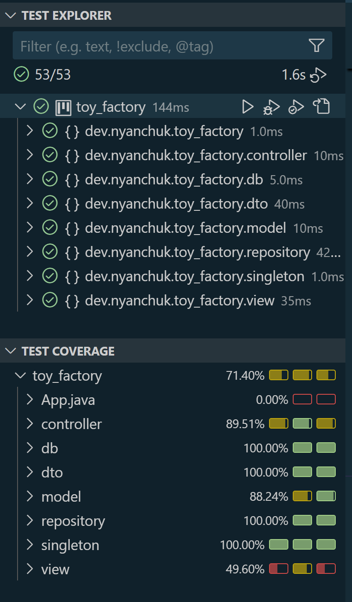
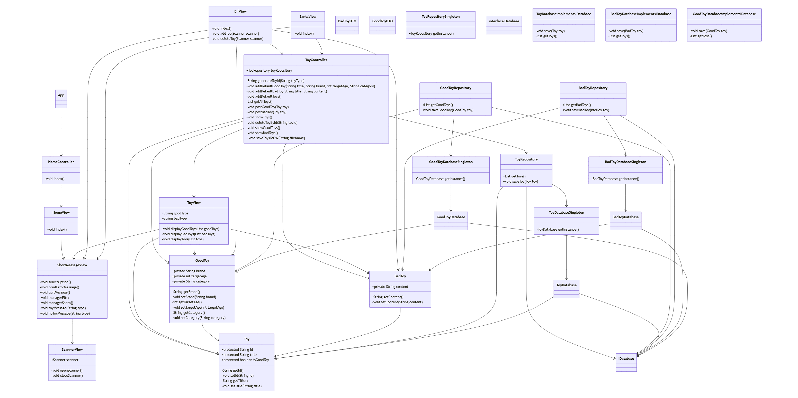

# Project - Santa Claus Toy Factory

## Description
OH! OH! OH! Santa Claus needs your help, developer!!! For this Christmas, Santa has decided to update his toy management system and leave behind the creation of long scrolls by hand. But WATCH OUT! The system will behave differently depending on whether it's used by Santa or one of his elves, and the data storage system will be different depending on whether the toy is for good children or bad children.

You have been tasked with creating a console application that will allow Santa’s elves to register toys created, list the inventory, and delete toys.

If the application is used by Santa, he will be able to view the list of toys for good children or the list of toys for bad children. He will also have the ability to save the complete list of all toys in .csv format.

Gradually approach the classic architecture of Spring Boot. Apply the MVC (Model-View-Controller) architecture pattern to structure the application. Understand and apply the repository pattern and dependency inversion.

### User Stories
1. AS an Elf I WANT to add a toy for a good child to the inventory by providing the title, brand, recommended age range, and category FOR its storage.

2. AS an Elf I WANT to add a toy for a bad child to the inventory by providing the title and its content FOR its storage.

3. AS an Elf I WANT to view the list of all toys FOR inventory control.

4. AS an Elf I WANT to delete a toy FOR avoiding defective toys in the inventory.

5. AS an Elf I WANT to log out FOR ending my workday.

6. AS Santa I WANT to view the list of toys for good children FOR inventory checking.

7. AS Santa I WANT to view the list of toys for bad children FOR inventory checking.

8. AS Santa I WANT to save the list of all toys in .csv format FOR data verification using an external application.

9. AS Santa I WANT to log out FOR ending my workday.

## Pre-requisites
Before running the project, make sure you have the following installed:
- Java JDK 8 or higher
- Maven
- Visual Studio Code

## Installation Steps
1. Clone the repository:
    ```
    git clone https://github.com/your-repository-url
    ```
2. Navigate into the project directory:
    ```
    cd toy-factory
    ```
3. Build the project using Maven
    ```
    mvn clean install
    ```

## Execution of Tests
1. Run the tests using Maven:
   - For Maven: 
     ```
     mvn test
     ```

## Diagrams
Include diagrams such as:
- **Test Coverage Diagram**:



- **Class Diagram**:




## Author
**Nelli Yanchuk** - Developer

Contact me with: [GitHub](https://github.com/NelliYanchuk) / [LinkedIn](https://www.linkedin.com/in/nelli-yanchuk-a24b81138/)
